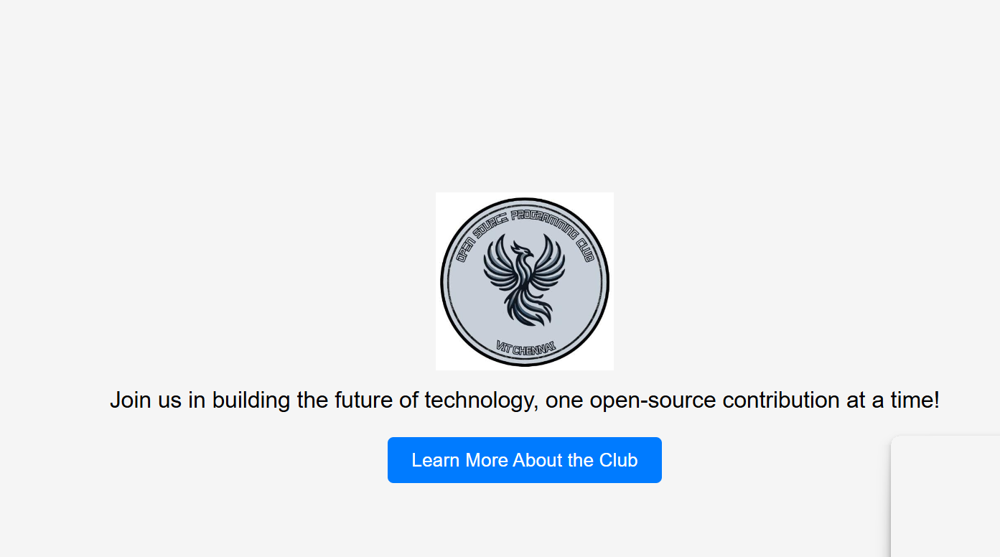
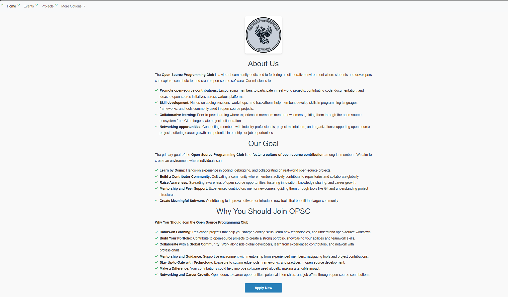
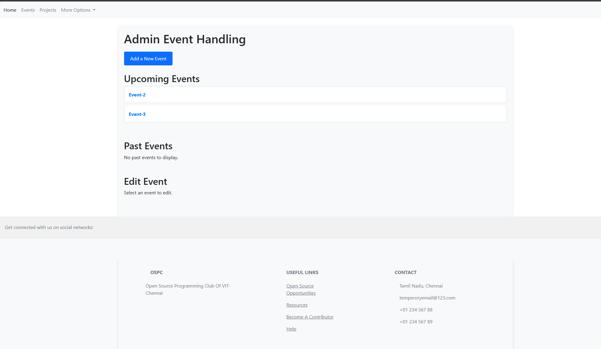
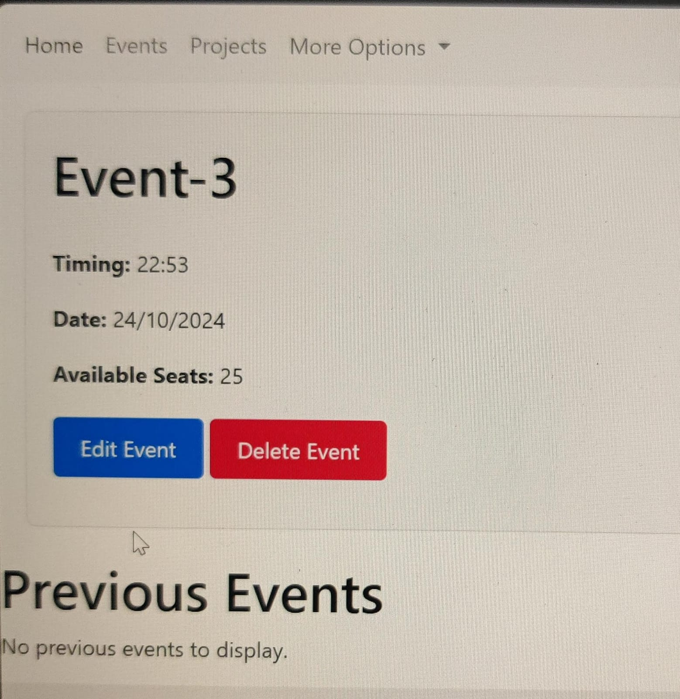
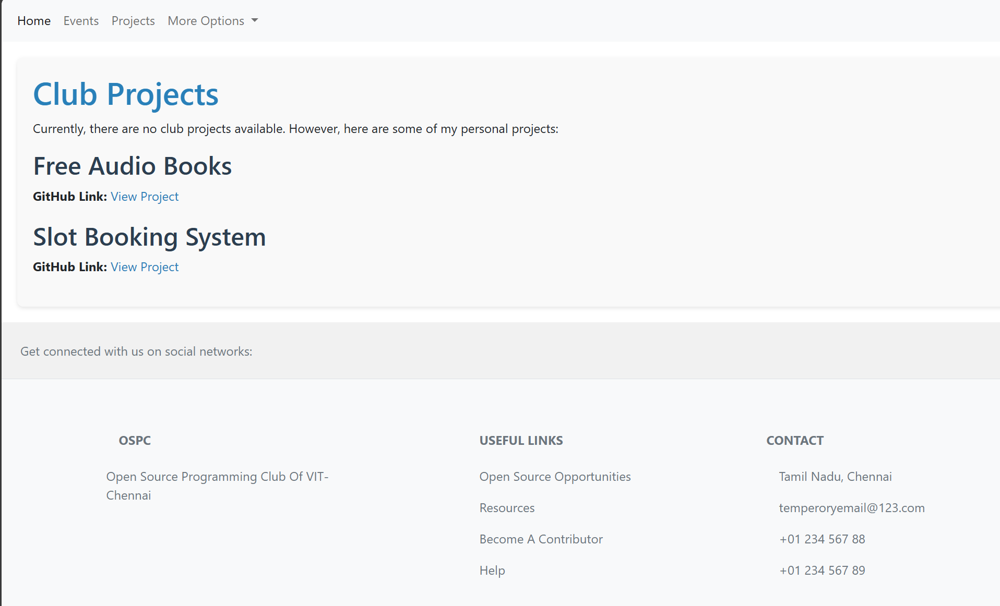

# Website Overview

This project is a basic website developed for event management, primarily focused on backend integration. Due to time constraints, I have only implemented the backend functionality for **admin event management**, allowing admins to perform basic CRUD (Create, Read, Update, Delete) operations along with event scheduling.

### Styling
Styling for this website was done with assistance from **ChatGPT**, as there was limited time available for this phase of the project.

### Current Limitations
- The website is **not yet deployed**, and a cloud database connection has not been established.
- If you wish to run the project locally, you will need to:
  1. Clone the repository.
  2. Set up a local database and connect it to the project.

### Features
- **Admin Dashboard**: Allows admins to manage events with full CRUD functionality and scheduling.
- **User Visibility**: Users can view events created by the admin.
- Basic **authentication, authorization**, and **error handling** are placeholders and will be fully implemented in the future.

### Screenshots

#### 1. Starting Page

#### 2. About Page

#### 3. Events Page

#### 4. Users' View of Event Registration

#### 5. Admin Routes

#### 6. Admin CRUD Operations
- **New Event Scheduling**
  
- **Edit Event Scheduling**
  

#### 7. Projects Page

### Future Improvements
In the future, I plan to:
- Deploy the website to a cloud platform.
- Connect it to a cloud database.
- Implement full authentication, authorization, and error handling once I get more comfortable with deployment and these aspects of development.
